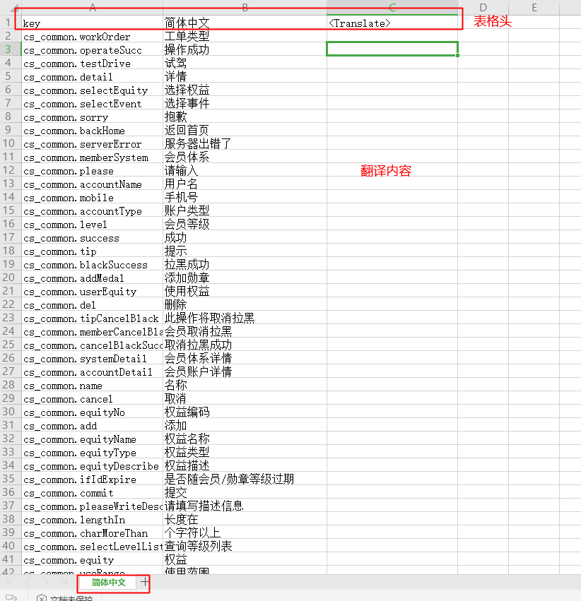
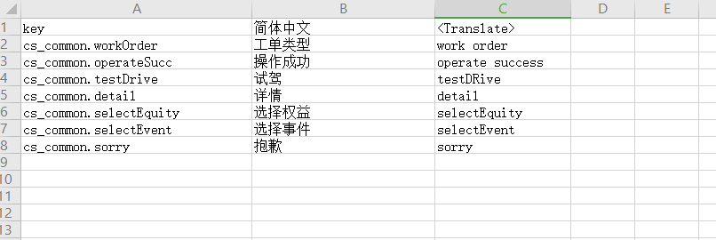

## 项目国际化处理工具

### 项目中中文的提取与国际化写入脚本使用手册

> 1. 目前脚本 **仅支持 components 与 pages 里的 .vue 文件和 .js 文件** 中的中文提取与写入，如果涉及其他文件夹下的内容，可根据脚本内容进行修改对应需要处理的文件内容
> 2. 目前支持 vue 项目
> 3. 写入的脚本需 **本地 node 环境版本不能低于 10.12.0**

#### 使用手册

1. 安装工具依赖包

> $ npm i -g i18n-collect-cli

2. 执行 getLang 进行提取中文操作，filename 默认为 zh_cn.json

> $ i18n-cli getlang [pages] -f <filename> -d pages,components

执行完成后会在同级目录下生成一个 zh_cn.json 文件，内容格式形同如下：

```js
{
  "cs_common": {
    "cs_1": "用户ID",
    "cs_2": "搜索",
  },
  "cs_error": {
    "cs_3": "请输入小于200字符！",
    "cs_4": "请正确填写年龄([0~120])！"
  }
}
```

3. 将 zh_cn.json 文件中的中文对应的 key 用语义化字符串代替，修改后得到的 zh_cn.json 文件如下

```js
{
  "cs_common": {
    "userId": "用户ID",
    "search": "搜索",
  },
  "cs_error": {
    "maxInput": "请输入小于200字符！",
    "ageTip": "请正确填写年龄([0~120])！"
  }
}
```

4. 执行 writeLang 将中文以 i18n 的模式写入文件（仅支持 components 与 pages 里的 .vue 文件和 .js 文件）

> $ i18n-cli writelang [src] -f <filename> -d pages,components

> 注：非 .vue 文件需要引用 i18n 才能使用

执行以上脚本后会在 src 同级目录生成 srcDist 文件夹，文件夹内仅包含 components 与 pages 文件夹下的 .vue 文件和 .js 文件

5. 将 srcDist 文件夹内容替换到 src 文件夹中，覆盖重复的文件

6. 将 zh_cn.json 内数据放入项目中的多语言模块，运行项目，全局遍历一下是否有遗漏


> 注： 以上基于项目中已加入 i18n ，并且已做好配置。

该脚本还不够完善，但目前能够解决几个未做这一块的能力中心项目的多语言的初步处理，能够提高一定的效率。另外，欢迎补充。

### 国际化语言提取与写入

专业的事情找专业的人做，毕竟不是所有的开发人员都能做翻译。所以会有找相关翻译人员处理国际化语言的需求，估有了此工具，用于提取js文件里的关键数据，转成excel表格交给专业的人进行翻译

#### 国际化语言的提取

1、将语言文件 zh.js 转成 excel 表格，好提供给专业的人进行翻译

> i18n-cli toexcel [url] [translateUrl] [filename] 

url 必填，为js文件的路径
translateUrl 选填，为已经翻译的语言的js，用于提取语言增量
filename 默认为zh.xlsx, 默认保存路径为当前执行命令的路径，且保存路径不可修改

** 注：js中对象的 key 必须带引号，如下**

```js
export default {
  'common': {
    'workOrder': '工单类型',
    'operateSucc': '操作成功',
    'testDrive': '试驾',
    'detail': '详情',
    'selectEquity': '选择权益',
    'selectEvent': '选择事件',
    'sorry': '抱歉'
    ...
  }
  ...
}
```
如果没有选择已经翻译的语言的js时，最后生成的excel表格如下



如果选择了已经翻译的语言的js，如

```js
export default {
  'cs_common': {
    'detail': 'detail',
    'selectEquity': 'selectEquity',
    'selectEvent': 'selectEvent',
    'sorry': 'sorry'
  }
}

```

则生成的 excel 表格如下


此时，将key列隐藏后（防止key值被修改）即可将此 excel 表格提供给专业的人员，做专业的翻译了

#### 多语言的写入

翻译完成后还需将 excel 表格的翻译内容用该脚本处理成js文件，引入到项目中做多语言的展示

1、将翻译好的文件整理成 js 文件

> $ i18n-cli tojs [url] [filename]

   [filename] 多语言js文件，默认 translate.js, 默认当前位置，不能修改存储地址，如xx.js,
   [url] excel文件路径，格式可以为".xls", ".xml",".xlsx",".xlsm"

如 excel 文件内容如下



执行结束后会在根目录生成一个 transform.js 文件，文件内容如下


